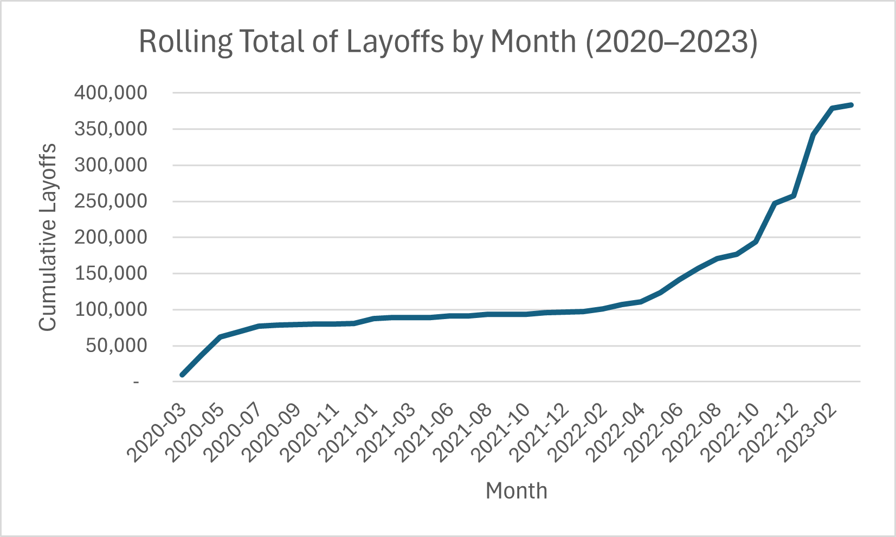

# Introduction

This SQL project explores global layoffs data and is divided into two main parts: data cleaning and exploratory data analysis (EDA). The goal was to clean and transform a real-world dataset to prepare it for analysis, and then use SQL to uncover patterns in layoff trends by company, industry, country, and year.

The dataset used in this project was originally sourced from [Kaggle](https://www.kaggle.com/datasets/swaptr/layoffs-2022) and provided by instructor Alex The Analyst as part of his MySQL course. All queries were written and executed in MySQL Benchmark.

# Background
I chose this project as part of my transition into a career in data analytics. I took this course to build and improve my SQL skills through hands-on practice with real-world data.

This project gave me experience in both data cleaning and exploratory data analysis (EDA). It reinforced the importance of using staging tables to avoid altering raw data, and introduced me to helpful techniques like using `ROW_NUMBER() OVER(PARTITION BY ...)` to identify and remove duplicates.

My main goal was to strengthen my SQL skills for job preparation, learning, and portfolio building—all at once.

# Tools I Used

- **MySQL Benchmark**: Used to write and execute all SQL queries throughout the data cleaning and analysis process.
- **Git & GitHub**: Used to publish and version-control the completed project as part of my data analytics portfolio.
- **Visual Studio Code**: Used to write and format this README.

# The Analysis: Data Cleaning

### Step 1: Create a Staging Table

To avoid modifying the original raw dataset, a staging table (`layoffs_staging`) was created to perform all data cleaning operations.

```sql
CREATE TABLE layoffs_staging
LIKE layoffs;

INSERT layoffs_staging
SELECT *
FROM layoffs;
```

### Step 2: Identify and Remove Duplicates

Duplicates were found using ROW_NUMBER() with a PARTITION BY on all relevant columns. A second staging table (layoffs_staging2) was created to store the deduplicated data.

```sql
-- Add row numbers to identify duplicates
INSERT INTO layoffs_staging2
SELECT *,
ROW_NUMBER() OVER(
    PARTITION BY company, location, industry, total_laid_off,
    percentage_laid_off, `date`, stage, country, funds_raised_millions
) AS row_num
FROM layoffs_staging;

-- Remove duplicates where row_num > 1
DELETE
FROM layoffs_staging2
WHERE row_num > 1;
```

### Step 3: Standardize Company, Industry, Country, and Date Values
This step involved standardizing text formats, removing trailing punctuation, and converting date strings to DATE format.

```sql
-- Trim whitespace from company names
UPDATE layoffs_staging2
SET company = TRIM(company);

-- Standardize variations of 'Crypto'
UPDATE layoffs_staging2
SET industry = 'Crypto'
WHERE industry LIKE 'Crypto%';

-- Remove trailing periods from 'United States.'
UPDATE layoffs_staging2
SET country = TRIM(TRAILING '.' FROM country)
WHERE country LIKE 'United States%';

-- Convert text-based date column to SQL DATE type
UPDATE layoffs_staging2
SET `date` = STR_TO_DATE(`date`, '%m/%d/%Y');

ALTER TABLE layoffs_staging2
MODIFY COLUMN `date` DATE;
```

### Step 4: Handle Null and Blank Values

This step replaced blanks with NULL in the industry column, and attempted to fill missing values using self-joins when possible.

```sql
-- Replace blank values with NULL
UPDATE layoffs_staging2
SET industry = NULL
WHERE industry = '';

-- Populate NULLs using values from matching company rows
UPDATE layoffs_staging2 t1
JOIN layoffs_staging2 t2
    ON t1.company = t2.company
SET t1.industry = t2.industry
WHERE t1.industry IS NULL
AND t2.industry IS NOT NULL;
```

### Step 5: Remove Rows with Missing Key Values

Rows with both total_laid_off and percentage_laid_off missing were deleted, as they lacked enough information for analysis.

```sql
DELETE
FROM layoffs_staging2
WHERE total_laid_off IS NULL
AND percentage_laid_off IS NULL;
```

### Step 6: Drop Temporary Columns
The row_num column used for identifying duplicates was removed after cleaning was complete.

```sql
ALTER TABLE layoffs_staging2
DROP COLUMN row_num;
```

# The Analysis: Exploratory Data Analysis (EDA)

### Question 1: What is the range of total layoffs in a single event?

To understand the scale of layoffs, we identified both the largest and smallest layoff events recorded in the dataset.

**Insight**: The largest single layoff event affected 12,000 employees, while the smallest involved just 3. This shows that companies downsized at vastly different scales—ranging from small adjustments to mass workforce reductions.

```sql
SELECT MAX(total_laid_off), MIN(total_laid_off)
FROM layoffs_staging2;
```
| MAX(total_laid_off) | MIN(total_laid_off) |
|---------------------|---------------------|
| 12,000              | 3                   |

*This table shows the range of total layoffs reported in individual events across the dataset.*

### Question 2: Which companies laid off 100% of their workforce?

To understand the most extreme layoff events, we first identified the maximum percentage of workforce reductions, then filtered for companies where the percentage_laid_off was 1—indicating the entire workforce was let go.

**Insight**: Numerous companies—including Katerra, Butler Hospitality, and Deliv—completely shut down operations, laying off 100% of their employees. Many of these companies had raised millions in funding, showing that even heavily backed startups were not immune to full collapse.

```sql
-- Check the maximum layoff percentage
SELECT MAX(percentage_laid_off)
FROM layoffs_staging2;

-- Filter for companies that laid off 100% of their workforce
SELECT *
FROM layoffs_staging2
WHERE percentage_laid_off = 1
ORDER BY total_laid_off DESC;
```

| Company            | Location      | Industry       | Total Laid Off | Date       | Country       | Funds Raised (\$M) |
| ------------------ | ------------- | -------------- | -------------- | ---------- | ------------- | ------------------ |
| Katerra            | SF Bay Area   | Construction   | 2,434          | 2021-06-01 | United States | 1,600              |
| Butler Hospitality | New York City | Food           | 1,000          | 2022-07-08 | United States | 50                 |
| Deliv              | SF Bay Area   | Retail         | 669            | 2020-05-13 | United States | 80                 |
| Jump               | New York City | Transportation | 500            | 2020-05-07 | United States | 11                 |
| SEND               | Sydney        | Food           | 300            | 2022-05-04 | Australia     | 3                  |

*This table highlights a few of the companies that experienced full workforce layoffs, often despite substantial financial backing.*

### Question 3: Which companies laid off the most employees overall?

To identify the companies most impacted by layoffs, we aggregated the total number of employees laid off across all reported events per company and sorted them in descending order.

**Insight**: Major tech companies dominate the list, with Amazon leading by a wide margin at over 18,000 reported layoffs. Google, Meta, and Microsoft also show significant totals, reflecting broader industry-wide cuts during the dataset’s time range.

```sql
SELECT company, SUM(total_laid_off) AS sum_laid_off
FROM layoffs_staging2
GROUP BY company
ORDER BY 2 DESC
LIMIT 10;
```
| Company     | Total Laid Off |
| ----------- | -------------- |
| Amazon      | 18,150         |
| Google      | 12,000         |
| Meta        | 11,000         |
| Salesforce  | 10,090         |
| Microsoft   | 10,000         |
| Philips     | 10,000         |
| Ericsson    | 8,500          |
| Uber        | 7,585          |
| Dell        | 6,650          |
| Booking.com | 4,601          |

*This table shows the top 10 companies by total number of layoffs across all recorded events.*

### Question 4: What is the time range of the layoff data?

To understand the time coverage of the dataset, we identified the earliest and latest dates recorded in the data.

**Insight**: The dataset spans from March 11, 2020 to March 6, 2023, covering three full years of layoff activity—coinciding with the COVID-19 pandemic and subsequent market corrections in tech.

| Earliest Date | Latest Date |
| ------------- | ----------- |
| 2020-03-11    | 2023-03-06  |

*This table shows the start and end dates of layoff data captured in the dataset.*

### Question 5: Which industries experienced the most layoffs?
To understand which sectors were hit hardest, we grouped layoffs by industry and calculated the total number of employees laid off in each.

**Insight**: The Consumer and Retail industries experienced the highest number of layoffs, followed closely by Transportation and Finance. This suggests that customer-facing and logistics-heavy sectors were among the most vulnerable during this period.

```sql
SELECT industry, SUM(total_laid_off) AS sum_laid_off
FROM layoffs_staging2
GROUP BY industry
ORDER BY 2 DESC;
```

| Industry       | Total Laid Off |
| -------------- | -------------- |
| Consumer       | 45,182         |
| Retail         | 43,613         |
| Other          | 36,289         |
| Transportation | 33,748         |
| Finance        | 28,344         |
| Healthcare     | 25,953         |
| Food           | 22,855         |
| Real Estate    | 17,565         |
| Travel         | 17,159         |
| Hardware       | 13,828         |

*This table shows the top 10 industries with the highest number of total layoffs during the observed period.*

### Question 6: Which countries had the highest total layoffs?
To understand the global impact of layoffs, we grouped the data by country and calculated the total number of employees laid off.

**Insight**: The United States experienced by far the highest number of layoffs, with over 250,000 affected employees—nearly eight times more than the next-highest country, India. This highlights the disproportionate scale of layoffs in the U.S. tech and startup ecosystems.

```sql
SELECT country, SUM(total_laid_off) AS sum_laid_off
FROM layoffs_staging2
GROUP BY country
ORDER BY 2 DESC
LIMIT 10;
```

| Country        | Total Laid Off |
| -------------- | -------------- |
| United States  | 256,559        |
| India          | 35,993         |
| Netherlands    | 17,220         |
| Sweden         | 11,264         |
| Brazil         | 10,391         |
| Germany        | 8,701          |
| United Kingdom | 6,398          |
| Canada         | 6,319          |
| Singapore      | 5,995          |
| China          | 5,905          |

*This table shows the top 10 countries by total number of layoffs in the dataset.*

### Question 7: How did layoffs change over the years?

We aggregated the number of layoffs by year to identify trends and shifts in layoff volumes from 2020 to 2023.

**Insight**: Layoffs surged in 2022 and remained high into 2023, likely reflecting the broader economic downturn and tech market corrections. Although 2020 saw substantial layoffs due to the pandemic, the post-2021 spike suggests ongoing volatility. A few entries lacked date values, contributing to a small null total.

```sql
SELECT YEAR(`date`) AS `year`, SUM(total_laid_off) AS sum_laid_off
FROM layoffs_staging2
GROUP BY YEAR(`date`)
ORDER BY 1 DESC;
```

| Year | Total Laid Off |
| ---- | -------------- |
| 2023 | 125,677        |
| 2022 | 160,661        |
| 2021 | 15,823         |
| 2020 | 80,998         |
| NULL | 500            |

*This table shows total layoffs by year, with a small number of records missing a valid date.*

### Question 8: What funding stages had the most layoffs?
To understand at what point in a company’s lifecycle layoffs were most concentrated, we grouped and summed total layoffs by funding stage.

**Insight**: Post-IPO companies experienced by far the highest number of layoffs—over 200,000. This may reflect public market pressures and investor expectations. Interestingly, companies with unknown funding stages and those recently acquired also showed high layoff counts, while later-stage private funding rounds (Series C to H) had progressively smaller totals.

| Stage          | Total Laid Off |
| -------------- | -------------- |
| Post-IPO       | 204,132        |
| Unknown        | 40,716         |
| Acquired       | 27,576         |
| Series C       | 20,017         |
| Series D       | 19,225         |
| Series B       | 15,311         |
| Series E       | 12,697         |
| Series F       | 9,932          |
| Private Equity | 7,957          |
| Series H       | 7,244          |

*This table shows the top 10 funding stages by total number of employees laid off.*

### Question 9: What are the monthly and cumulative layoffs over time?
To identify layoff trends, we calculated monthly totals and used a window function to generate a cumulative (rolling) total of all layoffs across the timeline.

**Insight**: The line chart shows a steady rise in layoffs starting in 2022, with a dramatic spike in January 2023 when over 84,000 employees were laid off in a single month. By March 2023, the cumulative total surpassed 383,000 — revealing how workforce reductions intensified in the post-pandemic economy.

```sql
WITH Rolling_Total AS (
  SELECT 
    SUBSTRING(`date`, 1, 7) AS `MONTH`, 
    SUM(total_laid_off) AS sum_laid_off 
  FROM layoffs_staging2
  WHERE SUBSTRING(`date`, 1, 7) IS NOT NULL
  GROUP BY `MONTH`
  ORDER BY 1 ASC
)
SELECT 
  `MONTH`, 
  sum_laid_off, 
  SUM(sum_laid_off) OVER (ORDER BY `MONTH`) AS rolling_total
FROM Rolling_Total;
```


*This line chart shows the cumulative number of layoffs over time, highlighting major surges in 2022 and early 2023.*

### Question 10: Which companies had the highest layoffs each year?
To identify which companies were most affected annually, we grouped total layoffs by company and year, then ranked the top 5 for each year using a window function.

**Insight**: The analysis reveals how certain companies dominated layoff headlines in specific years. For example, Uber led in 2020, Meta in 2022, and Google in 2023. These shifts reflect changing industry pressures during the pandemic and post-pandemic adjustments.

```sql
WITH Company_Year AS (
  SELECT company, YEAR(`date`) AS years, SUM(total_laid_off) AS sum_laid_off
  FROM layoffs_staging2
  GROUP BY company, YEAR(`date`)
),
Company_Year_Rank AS (
  SELECT *, 
  DENSE_RANK() OVER(PARTITION BY years ORDER BY sum_laid_off DESC) AS ranking
  FROM Company_Year
  WHERE years IS NOT NULL
)
SELECT *
FROM Company_Year_Rank
WHERE ranking <= 5;
```

| Year | Company     | Total Laid Off | Rank |
| ---- | ----------- | -------------- | ---- |
| 2020 | Uber        | 7,525          | 1    |
| 2020 | Booking.com | 4,375          | 2    |
| 2020 | Groupon     | 2,800          | 3    |
| 2020 | Swiggy      | 2,250          | 4    |
| 2020 | Airbnb      | 1,900          | 5    |
| 2021 | Bytedance   | 3,600          | 1    |
| 2021 | Katerra     | 2,434          | 2    |
| 2021 | Zillow      | 2,000          | 3    |
| 2021 | Instacart   | 1,877          | 4    |
| 2021 | WhiteHat Jr | 1,800          | 5    |
| 2022 | Meta        | 11,000         | 1    |
| 2022 | Amazon      | 10,150         | 2    |
| 2022 | Cisco       | 4,100          | 3    |
| 2022 | Peloton     | 4,084          | 4    |
| 2022 | Carvana     | 4,000          | 5    |
| 2022 | Philips     | 4,000          | 5    |
| 2023 | Google      | 12,000         | 1    |
| 2023 | Microsoft   | 10,000         | 2    |
| 2023 | Ericsson    | 8,500          | 3    |
| 2023 | Amazon      | 8,000          | 4    |
| 2023 | Salesforce  | 8,000          | 4    |
| 2023 | Dell        | 6,650          | 5    |

*This table shows the top 5 companies with the highest total layoffs per year from 2020 to 2023.*

# Conclusion

This project involved cleaning and analyzing a real-world dataset of global layoffs from 2020 to early 2023 using MySQL. The goal was to practice writing efficient SQL queries, handle messy data, and extract insights through exploratory data analysis.

### Key Takeaways

- Layoff events varied widely — from as few as 3 employees to as many as 12,000 in a single instance.
- Several companies laid off 100% of their workforce, including Katerra and Butler Hospitality, often despite raising millions in funding.
- Amazon, Google, and Meta had the highest total layoffs over the period analyzed.
- The U.S. accounted for the majority of global layoffs, followed by India and several European countries.
- Post-IPO companies experienced the most layoffs, suggesting market shifts significantly impacted public companies.
- November 2022 marked the peak in monthly layoffs, followed by a continued upward trend in early 2023.

### Personal Reflection
This project solidified my understanding of real-world data cleaning techniques—especially the importance of using staging tables and window functions like ROW_NUMBER() for deduplication. It also improved my ability to structure multi-step EDA queries for storytelling with data.